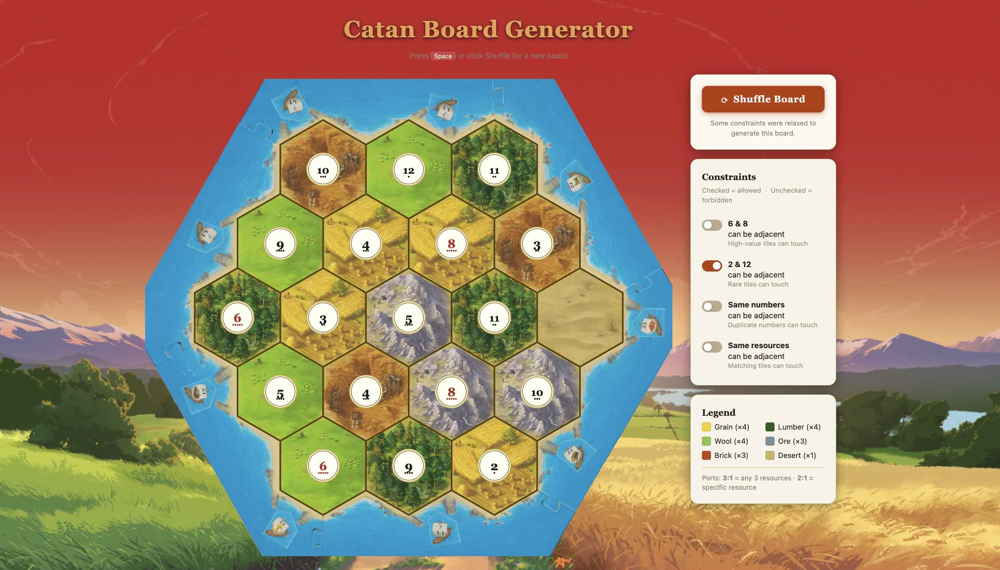

# Catan Board Generator

A random Catan board generator with configurable placement constraints. Built with vanilla JS and SVG, deployed as a static site on GitHub Pages.

<p align="center">
  
</p>


## Features

- Randomizes resource tiles and number tokens on every generation
- Configurable placement constraints:
  - **No 6/8 adjacency** — prevents high-probability numbers from touching (on by default)
  - **No same number adjacency** — prevents duplicate numbers from touching (on by default)
  - **No same resource adjacency** — prevents identical resources from touching (on by default)
  - **No 2/12 adjacency** — optionally separate the low-probability numbers
- Press **Space** or **Enter** to regenerate
- Constraints auto-regenerate the board when toggled

## Development

```bash
npm install
npm run dev        # Vite dev server at http://localhost:5173
npm run build      # Production build → dist/
```

## Deployment

Push to `main` — GitHub Actions builds with Docker and deploys to GitHub Pages automatically.

```bash
# Manual local build (requires Docker)
docker buildx build --target export --output type=local,dest=./dist .
```

## Project Structure

```
src/
  js/
    main.js          # Entry point, keyboard shortcuts, constraint wiring
    generator.js     # Fisher-Yates shuffle + constraint retry loop
    renderer.js      # SVG rendering (tiles, ports, number tokens)
    board-config.js  # Board layout data (hex coordinates, port positions)
    constraints.js   # Pure constraint-checking functions
    hex-grid.js      # Axial coordinate math for pointy-top hexes
    assets.js        # Centralised asset import map
  assets/
    tiles/           # Resource tile PNGs
    numbers/         # Number token SVGs (2–12, no 7)
    ports/           # Port PNGs
```

## License

MIT © 2026 Nikesh Gyawali
